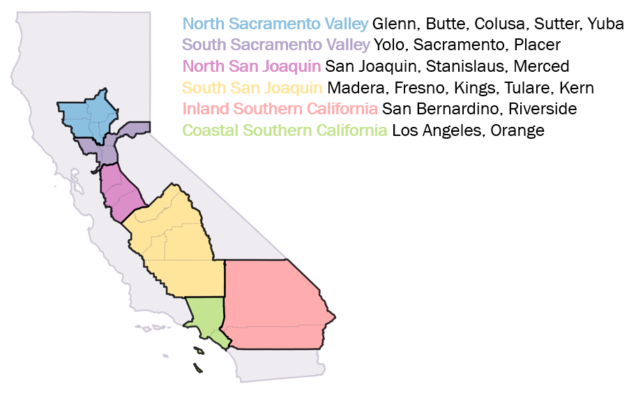

# WNV California Forecasting Challenge 2026

This is the data repository for the 2026 CDPH West Nile virus Forecasting Challenge. This is an open (*by request*) forecasting challenge to predict monthly West Nile virus (WNV) total disease cases in select California counties in 2026 in the months of *May* through *December*.

## Forecasts of Reported West Nile Virus Cases in Select Counties in California

* **Dates**: The Challenge Period will begin April 2026 and will run until October 2026. Participants are currently asked to submit forecasts by: *April 30th*, *May 31*, *June 30*, *July 31*, *August 31*, *September 30*, and *October 31* (herein referred to as the Forecast Due Dates). All submissions should include forecasts for all remaining months of 2025 (through December).

* **Prediction Targets**: Participants need to submit the `quantile` distribution of cases in each region-month over the whole WNV, along with the `cdf` point probability of zero cases on the same spatiotemporal scale. Please refer to our [targets guide](https://github.com/cdphmodeling/wnvca-2025/tree/main/model-output#output_type) for more information.

## Participation 

To participate in the Challenge, please follow these steps: 
 * Contact modeling@cdph.ca.gov for instructions on how to request data and participate in the challenge.
 * Have a look at the [mosquito and bird](https://github.com/vectorsurv/ca-wnv-forecasting-challenge/tree/main/2025) data provided by the [VectorSurv](https://barkerlab.ucdavis.edu/vectorsurv-team/) team.
 * Prepare metadata for your model. 
 * Submit forecasts by the deadlines. 

## Data License and Reuse

We are grateful to the teams who have generated forecasts and made their forecast data publicly available under different terms and licenses. By default, forecasts are available under the CC-BY 4.0 license, although teams may specify release under a different license in their metadata. You will find the licenses (when provided) within the metadata contained within model-specific folders in the data-forecasts directory. Please consult these licenses before using these data to ensure that you follow the terms under which these data were released. 

## Contact

If you have questions about the challenge, please reach out to the organizers at modeling@cdph.ca.gov.
 
## Acknowledgments

This repository follows the guidelines and standards outlined by the [hubverse](https://hubdocs.readthedocs.io/en/latest/), which provides a set of data formats and open source tools for modeling hubs.
